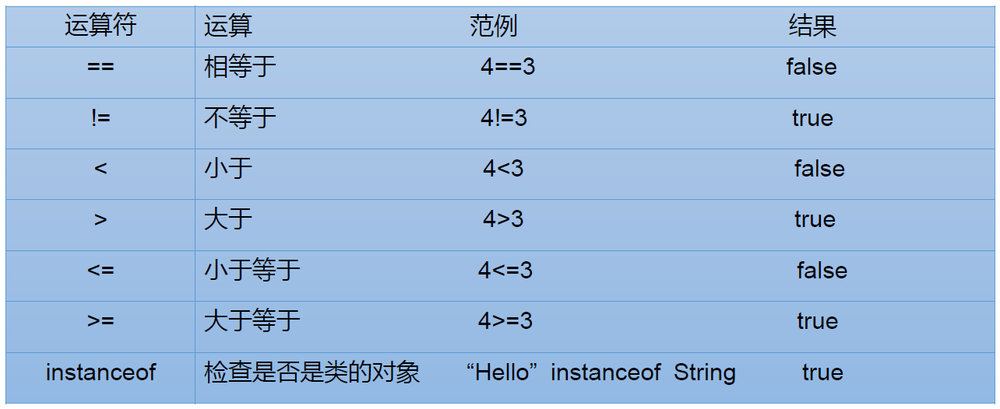

# Java基本语法

### 关键字和保留字
 - 关键字：被Java赋予了特殊含义，用做专门用途的字符串，关键字中所有字母均为小写。
 
 
 - 保留字：现有Java版本尚未使用，但以后版本可能会作为关键字使用。(goto,const)

### 标识符
标识符：Java对各种变量、方法和类等要素命名时使用的字符序列。    

定义合法标识符规则：
 - 由英文字母大小写，数字，_和$组成。
 - 数字不可开头
 - 不可使用关键字和保留字
 - 严格区分大小写，长度无限制
 
 <br> 
 Java名称命名规范  
 
 - 包名：多单词组成时所有字母都小写
 - 类名、接口名：多单词组成时，所有单词的首字母大写
 - 变量名、方法名：多单词组成时，第一个单词首字母小写，第二个单词开始每个单词首字母大写
 - 常量名：所有字母都大写，多单词时用下划线连接  
 
 ### 变量
变量包含：变量类型，变量名和存储的值  

使用变量注意：
 - Java中每个变量必须先声明后使用
 - 变量的作用域：其定义所在的一对{}内

变量的分类
 - 按数据类型
  
 - 按声明位置的不同
 
  
  
整数类型：byte,short,int,long   


 - Java整型变量默认为int，声明long型常量需后加‘L’或‘l’
 
浮点类型：float,double  

 - float：单精度，尾数可精确到7位有效数字，需后加‘f’

 - double：双精度，浮点型默认类型  
 
<br>

字符类型：char   
 - '单个字母'
 - Java中的所有字符都是用Unicode编码。因此，char类型是可以进行运算的。  


Boolean类型  

 - 只允许取值true和false，无null。  

 - 不可使用0或非0的整数替代false和true。
 - Java虚拟机中没有任何boolean值专用的字节码指令，编译后用int数据类型代替。

基本数据类型转换

自动类型转换：


注意：
 - 当把任何基本数据类型的值和字符串进行连接运算时，基本数据类型的值将自动转化为字
符串类型。
 - byte,short,char之间进行运算时转换为int类型

字符串类型：String  
 - String不是基本数据类型，属于引用数据类型

强制类型转换
 - 自动类型转换的逆过程，将容量大的数据类型转换为容量小的数据类型。使用时要加上强制转换
符：()，但可能造成精度降低或溢出。
 - 通常字符串不能转换为基本类型，但可通过基本类型对应的包装类则可实现。   
 String a = "43"; int i = Integer.parselnt(a);
 - boolean类型不可以转换为其他的数据类型
 
 ### 运算符
算数运算符


 - +除字符串相加功能外，还能把非字符串转换成字符串
 例如：System.out.println (“5+ 5+5); // 打印结果是5+5=55
 
赋值运算符
 - =当 “=”两侧数据类型不一致时，可以使用自动类型转换或使用强制类型转换原则进行处理。
 
比较运算符



逻辑运算符


位运算符


三元运算符


### 程序流程控制

#### if-else结构
例：  

```
public class AgeTest{
    public static void main(String args[]){
    int age = 18;
    if(age<0){
            System.out.println("错误");
    }else if(age>250){
            System.out.println("超过范围")；
    }else{
             System.out.println("年龄："+ age);
    }
   }   
 }
 ```
 
#### switch-case结构
```
switch(表达式）{  
case 常量1：  
     语句1；       
     //break;       
case 常量2：  
     语句2；       
     //break;  
…    
default：  
     语句；  
     //break  
```     
  - switch(表达式)中表达式的值必须是下述几种类型之一：byte，short，char，int，枚举(jdk5.0)，String(jdk7.0)
  - case子句中的值必须是常量
  
 #### for循环
```
for(①初始化部分;②循环条件部分;④迭代部分){  
     ③循环体部分       
 }
```

 - 初始化部分可以声明多个变量，但必须是同一个类型，用逗号分隔
 
 #### while循环
``` 
 ①初始化部分；     
 while(②循环条件部分){  
     ③循环体部分；       
     ④迭代部分；  
 }  
```
#### do-while循环
```
①初始化部分；     
 do{   
     ③循环体部分；       
     ④迭代部分；  
 }while(②循环条件部分)；  
 ```    
     
