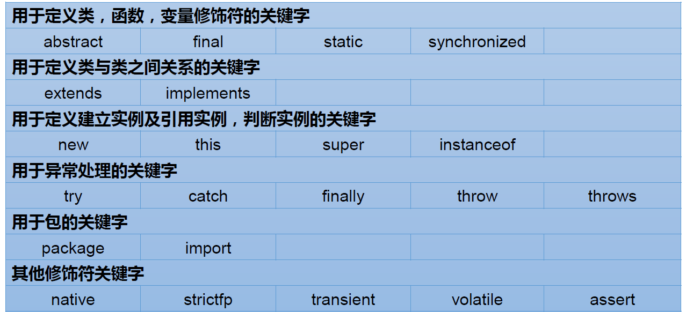
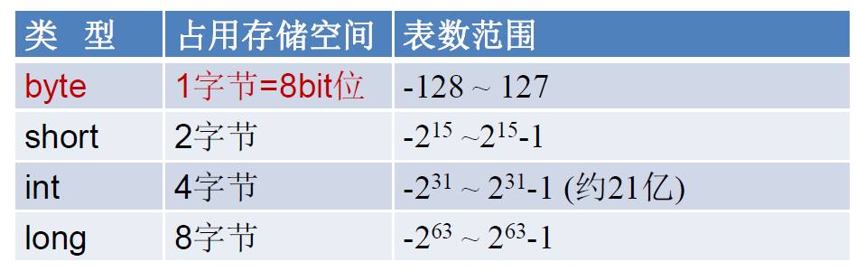
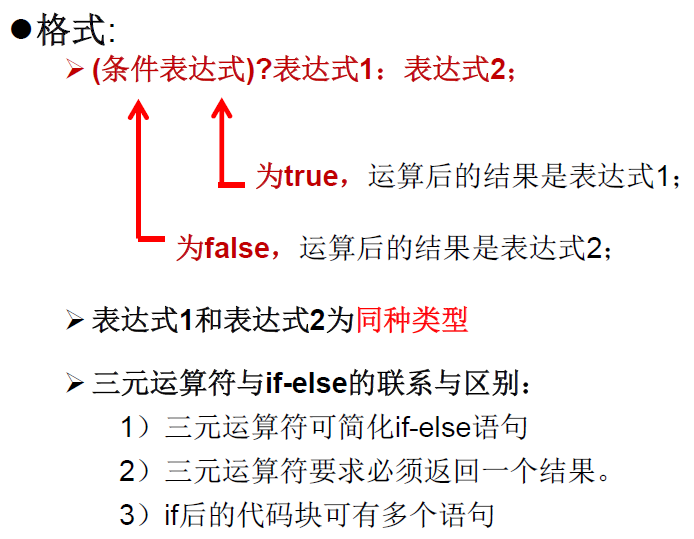

# Java-Learning
## Java语言概述

### Java技术体系平台
Java SE(Java Standard Edition)标准版：支持桌面级应用的Java平台，提供了完整的Java核心API。  

Java EE(Java Enterprise Edition)企业版，是为开发企业环境下的应用程序提供的一套解决方案。该技术体系中包含的技术主要针对于Web应用程序开发。  

Java ME(Java Micro Edition)小型版，支持Java程序运行在移动终端上的平台。  

Java Card：支持一些Java小程序运行在小内存设备上的平台

### Java语言的特点
 - 面向对象
 - 健壮性
 - 跨平台性
 
### JVM & JDK $ JRE
JVM(Java Virtual Machine)是一个虚拟的计算机，具有指令集并使用不同的存储区域。负责执行指令，管理数据、内存、寄存器。实现了“一次编译，到处运行”。  

JDK(Java Development Kit) = JRE + 开发工具（编译工具javac.exe、打包工具jar.exe）  

JRE(Java Runtime Environment) = JVM + Java程序核心类库

### 配置环境变量
根据windows系统查找可执行程序的原理，可将Java工具所在路径定义到Path环境变量中。

### 注释
//单行注释

<br>   


/*  

多行注释  

*/  

<br>   


/**  

文档注释  

Java特有  

注释内容可以被JDK提供的工具javadoc所解析，生成一套以网页文件形式体现的该程序的说明文档。  

操作方式：javadoc -d mydoc -author -version HelloWorld.java  

*/

### 注意事项
 - Java源文件是以java为扩展名。源文件的基本组成是类（class）。  

 - Java应用程序的执行入库时main()方法。固定书写格式： public static void main(String[]args){ }  

 - Java语言严格区分大小写。  

 - Java方法由语句构成，每个语句以“;”结束。  

 - 一个源文件中最多只能由一个public类。其他类的个数不限，如果源文件中包含一个public类，则文件名必须按该类名命名。
 
## Java基本语法

### 关键字和保留字
 - 关键字：被Java赋予了特殊含义，用做专门用途的字符串，关键字中所有字母均为小写。
 
 
 - 保留字：现有Java版本尚未使用，但以后版本可能会作为关键字使用。(goto,const)

### 标识符
标识符：Java对各种变量、方法和类等要素命名时使用的字符序列。    

定义合法标识符规则：
 - 由英文字母大小写，数字，_和$组成。
 - 数字不可开头
 - 不可使用关键字和保留字
 - 严格区分大小写，长度无限制
 
 <br> 
 Java名称命名规范  
 
 - 包名：多单词组成时所有字母都小写
 - 类名、接口名：多单词组成时，所有单词的首字母大写
 - 变量名、方法名：多单词组成时，第一个单词首字母小写，第二个单词开始每个单词首字母大写
 - 常量名：所有字母都大写，多单词时用下划线连接  
 
 ### 变量
变量包含：变量类型，变量名和存储的值  

使用变量注意：
 - Java中每个变量必须先声明后使用
 - 变量的作用域：其定义所在的一对{}内

变量的分类
 - 按数据类型
  
 - 按声明位置的不同
 
  
  
整数类型：byte,short,int,long   


 - Java整型变量默认为int，声明long型常量需后加‘L’或‘l’
 
浮点类型：float,double  

 - float：单精度，尾数可精确到7位有效数字，需后加‘f’

 - double：双精度，浮点型默认类型  
 
<br>

字符类型：char   
 - '单个字母'
 - Java中的所有字符都是用Unicode编码。因此，char类型是可以进行运算的。  


Boolean类型  

 - 只允许取值true和false，无null。  

 - 不可使用0或非0的整数替代false和true。
 - Java虚拟机中没有任何boolean值专用的字节码指令，编译后用int数据类型代替。

基本数据类型转换

自动类型转换：


注意：
 - 当把任何基本数据类型的值和字符串进行连接运算时，基本数据类型的值将自动转化为字
符串类型。
 - byte,short,char之间进行运算时转换为int类型

字符串类型：String  
 - String不是基本数据类型，属于引用数据类型

强制类型转换
 - 自动类型转换的逆过程，将容量大的数据类型转换为容量小的数据类型。使用时要加上强制转换
符：()，但可能造成精度降低或溢出。
 - 通常字符串不能转换为基本类型，但可通过基本类型对应的包装类则可实现。   
 String a = "43"; int i = Integer.parselnt(a);
 - boolean类型不可以转换为其他的数据类型
 
 ### 运算符
算数运算符


 - +除字符串相加功能外，还能把非字符串转换成字符串
 例如：System.out.println (“5+ 5+5); // 打印结果是5+5=55
 
赋值运算符
 - =当 “=”两侧数据类型不一致时，可以使用自动类型转换或使用强制类型转换原则进行处理。
 
比较运算符


逻辑运算符


位运算符


三元运算符



### 程序流程控制

#### if-else结构
例：  

```
public class AgeTest{
    public static void main(String args[]){
    int age = 18;
    if(age<0){
            System.out.println("错误");
    }else if(age>250){
            System.out.println("超过范围")；
    }else{
             System.out.println("年龄："+ age);
    }
   }   
 }
 ```
 
#### switch-case结构
```
switch(表达式）{  
case 常量1：  
     语句1；       
     //break;       
case 常量2：  
     语句2；       
     //break;  
…    
default：  
     语句；  
     //break  
```     
  - switch(表达式)中表达式的值必须是下述几种类型之一：byte，short，char，int，枚举(jdk5.0)，String(jdk7.0)
  - case子句中的值必须是常量
  
 #### for循环
```
for(①初始化部分;②循环条件部分;④迭代部分){  
     ③循环体部分       
 }
```

 - 初始化部分可以声明多个变量，但必须是同一个类型，用逗号分隔
 
 #### while循环
``` 
 ①初始化部分；     
 while(②循环条件部分){  
     ③循环体部分；       
     ④迭代部分；  
 }  
```
#### do-while循环
```
①初始化部分；     
 do{   
     ③循环体部分；       
     ④迭代部分；  
 }while(②循环条件部分)；  
 ```    
     
## 数组
### 数组的概述
 - 数组本身是引用数据类型，而数组中的元素可以是任何数据类型。
 - 创建数组对象会在内存中开辟一整块连续的空间，而数组中引用的是这块连续空间的首地址。
 - 数组的长度一旦确定，就不能修改。
### 一维数组的使用
#### 声明
- 一维数组的声明方式：type var[]或type[] var;
 ```
 int a[];
 int[] a1;
 double b[];
 String[] c; //引用类型变量数组
 ```
 - Java中声明数组时不能指定其长度，例如：int a[5];
 #### 初始化
 - 动态初始化：数组声明且为数组元素分配空间与复制的操作分开进行
 ```
 int[] arr = new int[3];
 arr[0] = 3;
 arr[1] = 9;
 arr[2] = 8;
 String names[];
 names = new String[3]
 names[0] = Mike;
 names[1] = Jane;
 names[2] = Linda;
 ```
  - 静态初始化：在定义数组的同时就为数组元素分配空间并赋值。
  ```
  int arr[] = new int[]{3,9,8};
  int[] arr = {3,9,8};
  ```
  #### 数组元素的默认初始化值
 
 
 ### 多维数组的使用
    
 
  
 
 ### Arrays工具类的使用
 

### 练习
 - 从键盘读入学生成绩，找出最高分，并输出学生成绩等级。
 ```
package array;

import java.util.Scanner;

public class ArrayDemo1 {
	public static void main(String[] args) {
		Scanner scanner = new Scanner(System.in);
		System.out.println("请输入学生人数：");
		int number = scanner.nextInt();
		int scores[] = new int[number];
		System.out.println("请输入"+number+"个学生成绩：");
		for(int i = 0; i < scores.length; i++) {
			scores[i] = scanner.nextInt();	
		}
		int maxScore = 0;
		for(int i = 0; i < scores.length;i++) {
			if(scores[i] > maxScore) {
				maxScore = scores[i];		
			}	
		}
		char level;
		for(int i = 0;i < scores.length; i++) {
			if(maxScore - scores[i] < 10) {
				level = 'A';
			}else if(maxScore - scores[i] <=20 ) {
				level = 'B';
			}else if(maxScore - scores[i] <= 30) {
				level = 'C';					
			}else{
				level = 'D';
			}
			System.out.println("student"+i+"'grade is "+level);
		}		
	}
}
```

 - 使用二维数组打印一个10行杨辉三角。
 ```
 package array;

public class ArrayDemo3 {
	public static void main(String[] args) {
		int[][] arr = new int[10][];
		for(int i = 0; i < arr.length;i++) {
			arr[i] = new int[i+1];
			arr[i][0] = 1;
			arr[i][i] = 1;
			if(i > 1) {
				for(int j = 1; j < i; j++) {
					arr[i][j] = arr[i-1][j-1]+arr[i-1][j];
				}
			}
		}
		for(int i = 0; i < arr.length; i++) {
			for(int j = 0; j < arr[i].length; j++) {
				System.out.print(arr[i][j] + " ");
			} 
			System.out .println();
		}
	}
}
```
 - 数组的复制与反转
 ```
 package array;

public class ArrayDemo4 {
	public static void main(String[] args) {
		int[] arr1,arr2;
		arr1 = new int[] {2,3,5,7,11,13};
		for(int i = 0; i < arr1.length; i++) {
			System.out.print(arr1[i]+"\t");
		}
		//数组的复制
		//arr2 = arr1; 不是真正的数组的复制，只是地址值的复制，修改其一另一个也会改变。
		arr2 = new int[arr1.length];
		for(int i = 0; i < arr1.length; i++) {
			arr2[i]=arr1[i];
		}
		//数组的反转
		for(int i = 0;i < arr1.length / 2;i++) {
			int temp = arr1[i];
			arr1[i] = arr1[arr1.length-i-1];
			arr1[arr1.length-i-1] = temp;
		}
	}

}
```
 - 数组的顺序查找
 ```
 package array;

public class LinearSearch {
	public static void main(String[] args) {
		String[] arr = new String[] {"a","b","c","d","e"};
		String dest = "c";
		boolean isflag = true;
		for(int i = 0; i < arr.length; i++) {
			if(dest.equals(arr[i])) {
				System.out.println("找到了指定元素，位置为"+i);
				isflag = false;
				break;				
			}
		}
		if(isflag) {
			System.out.println("未找到指定元素");
		}		
	}
}
```
 - 数组的二分法查找
 ```
 package array;

public class BinarySearch {
	public static void main(String[] args) {
		int[] arr = new int[] {-34,-25,-10,3,7,18,29,37,98};
		int dest = 37;
		int head = 0;
		int end = arr.length - 1;
		boolean isflag = true;
		while(head <= end) {
			int mid = (head + end) / 2;
			if(dest == arr[mid]) {
				System.out.println("找到了指定元素，索引位置为" + mid);
				isflag = false;
				break;
			}else if(dest < arr[mid]) {
				end = mid - 1;				
			}else {
				head = mid + 1;
			}
		}
		if(isflag) {
			System.out.println("未找到指定元素");
		}
	}
}
```

## 排序算法
### 衡量排序算法的优劣
 - 时间复杂度：分析关键字的比较次数和记录的移动次数
 - 空间复杂度：分析排序算法中需要多少辅助内存
 - 稳定性：若记录的A和B的关键字值相等，但排序后A和B的值保持不变，则称这种排序算法是稳定的
### 排序算法的分类
- 内部排序：不需要借助外部存储器
- 外部排序：必须借助外部存储器
### 十大内部排序算法
 - 选择排序
    - 直接选择排序，堆排序
 - 交换排序
    - 冒泡排序，快速排序
 - 插入排序
    - 直接插入排序，折半插入排序，Shell排序
 - 并归排序
 - 桶式排序
 - 基数排序
### 冒泡排序
 - 基本思想:依次比较相邻元素，若逆序则交换。
 ```
 package sort;

public class BubbleSort {
	public static void main(String[] args) {
		int[] arr = new int[] {89,7,46,34,95,19,0,-2,-87,89,66,-54};
		for(int i = 0; i < arr.length - 1; i++) {
			for(int j = 0; j < arr.length - 1 - i;j++) {
				if(arr[j] > arr[j+1]) {
					int temp = arr[j];
					arr[j] = arr[j + 1];
					arr[j + 1] = temp;
				}
			}
		}
		for(int i = 0;i < arr.length; i++) {
			System.out.print(arr[i] + " ");
		}
	}
}
```
### 快速排序
 - 基本思想：任取待排序的某个元素作为标准，通过一次划分，将待排元素分为左右两个子序列，对子序列继续进行划分。
```
package sort;


public class QuickSort {
	private static void swap(int[] data, int i, int j) {
		int temp = data[i];
		data[i] = data[j];
		data[j] = temp;
	}

	private static void subSort(int[] data, int start, int end) {
		if (start < end) {
			int base = data[start];
			int low = start;
			int high = end + 1;
			while (true) {
				while (low < end && data[++low] - base <= 0)
					;
				while (high > start && data[--high] - base >= 0)
					;
				if (low < high) {
					swap(data, low, high);
				} else {
					break;
				}
			}
			swap(data, start, high);
			
			subSort(data, start, high - 1);//递归调用
			subSort(data, high + 1, end);
		}
	}
	public static void quickSort(int[] data){
		subSort(data,0,data.length-1);
	}
	
	
	public static void main(String[] args) {
		int[] data = { 9, -16, 30, 23, -30, -49, 25, 21, 30 };
		System.out.println("排序之前：\n" + java.util.Arrays.toString(data));
		quickSort(data);
		System.out.println("排序之后：\n" + java.util.Arrays.toString(data));
	}
}
```
