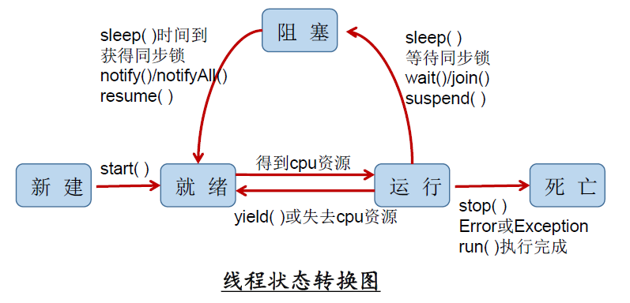

## 多线程
### 基本概念
 - 程序：一段静态的代买
 - 进程：正在运行的一个程序，是资源分配的单位。
 - 线程：调度和执行的单位，每个线程拥有独立的运行栈和程序计数器。共享方法区和堆空间。
 - 一个JAVA应用程序，至少三个线程，main()主线程、gc()垃圾回收线程，异常处理线程。
 - 并行：多个CPU同时执行多个任务
 - 并发：一个CPU同时执行多个任务
 
 ### 线程的创建和使用
 #### 多线程的创建方式一：继承于Thread类
  1. 创建一个继承于Thread类的子类
  2. 重写Thread类的run() --> 将此线程执行的操作声明在run()中
  3. 创建Thread类的子类的对象
  4. 通过此对象调用start()
 ```
 /**
 * 例子：遍历100以内的所有的偶数
 */

//1. 创建一个继承于Thread类的子类
class MyThread extends Thread {
    //2. 重写Thread类的run()
    @Override
    public void run() {
        for (int i = 0; i < 100; i++) {
            if(i % 2 == 0){
                System.out.println(Thread.currentThread().getName() + ":" + i);
            }
        }
    }
}


public class ThreadTest {
    public static void main(String[] args) {
        //3. 创建Thread类的子类的对象
        MyThread t1 = new MyThread();

        //4.通过此对象调用start():①启动当前线程 ② 调用当前线程的run()
        t1.start();
        //问题一：我们不能通过直接调用run()的方式启动线程。
//        t1.run();

        //问题二：再启动一个线程，遍历100以内的偶数。不可以还让已经start()的线程去执行。会报IllegalThreadStateException
//        t1.start();
        //我们需要重新创建一个线程的对象
        MyThread t2 = new MyThread();
        t2.start();


        //如下操作仍然是在main线程中执行的。
        for (int i = 0; i < 100; i++) {
            if(i % 2 == 0){
                System.out.println(Thread.currentThread().getName() + ":" + i + "***********main()************");
            }
        }
    }

}
```
#### Thread中地常用方法
 1. start():启动当前线程；调用当前线程的run()
 2. run(): 通常需要重写Thread类中的此方法，将创建的线程要执行的操作声明在此方法中
 3. currentThread():静态方法，返回执行当前代码的线程
 4. getName():获取当前线程的名字
 5. setName():设置当前线程的名字
 6. yield():释放当前cpu的执行权
 7. join():在线程a中调用线程b的join(),此时线程a就进入阻塞状态，直到线程b完全执行完以后，线程a才结束阻塞状态。
 8. stop():已过时。当执行此方法时，强制结束当前线程。
 9. sleep(long millitime):让当前线程“睡眠”指定的millitime毫秒。在指定的millitime毫秒时间内，当前线程是阻塞状态。
 10. isAlive():判断当前线程是否存活
 
 #### 线程的调度
 1. MAX_PRIORITY：10； MIN _PRIORITY：1； NORM_PRIORITY：5  -->默认优先级  

 2.如何获取和设置当前线程的优先级：
    - getPriority():获取线程的优先级
    - setPriority(int p):设置线程的优先级  
    
说明：高优先级的线程要抢占低优先级线程cpu的执行权。但是只是从概率上讲，高优先级的线程高概率的情况下被执行。并不意味着只有当高优先级的线程执行完以后，低优先级的线程才执行。

#### 多线程的创建方式二：实现Runnable接口
 1. 创建一个实现了Runnable接口的类
 2. 实现类去实现Runnable中的抽象方法：run()
 3. 创建实现类的对象
 4. 将此对象作为参数传递到Thread类的构造器中，创建Thread类的对象
 5. 通过Thread类的对象调用start()
```
//1. 创建一个实现了Runnable接口的类
class MThread implements Runnable{

    //2. 实现类去实现Runnable中的抽象方法：run()
    @Override
    public void run() {
        for (int i = 0; i < 100; i++) {
            if(i % 2 == 0){
                System.out.println(Thread.currentThread().getName() + ":" + i);
            }

        }
    }
}


public class ThreadTest1 {
    public static void main(String[] args) {
        //3. 创建实现类的对象
        MThread mThread = new MThread();
        //4. 将此对象作为参数传递到Thread类的构造器中，创建Thread类的对象
        Thread t1 = new Thread(mThread);
        t1.setName("线程1");
        //5. 通过Thread类的对象调用start():① 启动线程 ②调用当前线程的run()-->调用了Runnable类型的target的run()
        t1.start();

        //再启动一个线程，遍历100以内的偶数
        Thread t2 = new Thread(mThread);
        t2.setName("线程2");
        t2.start();
    }

}
```
 - 比较创建线程的两种方式。
    - 开发中：优先选择：实现Runnable接口的方式
    - 原因：1. 实现的方式没有类的单继承性的局限性 2. 实现的方式更适合来处理多个线程有共享数据的情况。
    - 联系：public class Thread implements Runnable
    - 相同点：两种方式都需要重写run(),将线程要执行的逻辑声明在run()中。
### 线程的生命周期


### 线程的同步
例子：创建三个窗口卖票，总票数为100张.使用实现Runnable接口的方式
 
 1.问题：卖票过程中，出现了重票、错票 -->出现了线程的安全问题  
 
 2.问题出现的原因：当某个线程操作车票的过程中，尚未操作完成时，其他线程参与进来，也操作车票。  
 
 3.如何解决：当一个线程a在操作ticket的时候，其他线程不能参与进来。直到线程a操作完ticket时，其他线程才可以开始操作ticket。这种情况即使线程a出现了阻塞，也不能被改变。  
 
 4.在Java中，我们通过同步机制，来解决线程的安全问题。
 
 5.同步的方式，解决了线程的安全问题。---好处  
 操作同步代码时，只能有一个线程参与，其他线程等待。相当于是一个单线程的过程，效率低。 ---局限性
 
#### 方式一：同步代码块
```
synchronized(同步监视器){
//需要被同步的代码
 }
 ```
 说明：  
 
 1.操作共享数据的代码，即为需要被同步的代码。  -->不能包含代码多了，也不能包含代码少了。  
 
 2.共享数据：多个线程共同操作的变量。比如：ticket就是共享数据。  
 
 3.同步监视器，俗称：锁。任何一个类的对象，都可以充当锁。  
 
要求：多个线程必须要共用同一把锁。  

补充：在实现Runnable接口创建多线程的方式中，我们可以考虑使用this充当同步监视器。  

在继承Thread类创建多线程的方式中，慎用this充当同步监视器，考虑使用当前类充当同步监视器。

### 方式二：同步方法。
如果操作共享数据的代码完整的声明在一个方法中，我们不妨将此方法声明同步的。

