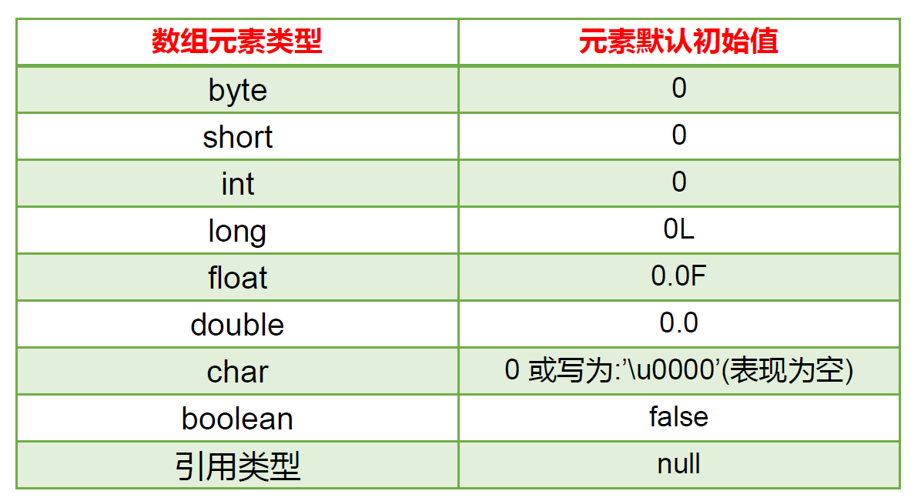
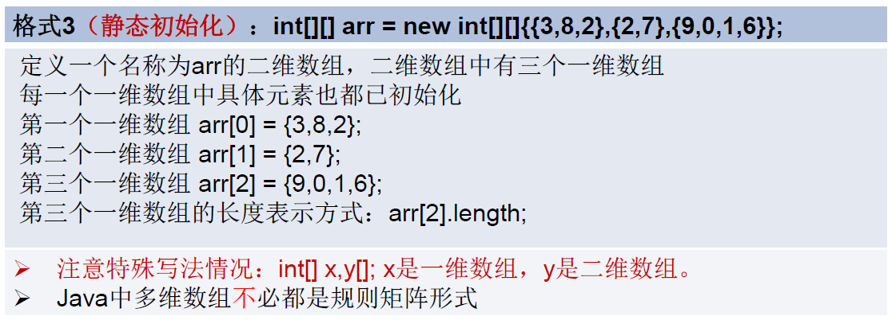
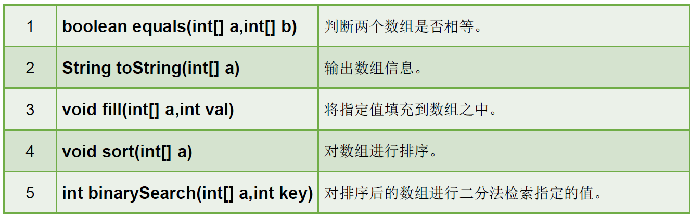

# 数组
### 数组的概述
 - 数组本身是引用数据类型，而数组中的元素可以是任何数据类型。
 - 创建数组对象会在内存中开辟一整块连续的空间，而数组中引用的是这块连续空间的首地址。
 - 数组的长度一旦确定，就不能修改。
### 一维数组的使用
#### 声明
- 一维数组的声明方式：type var[]或type[] var;
 ```
 int a[];
 int[] a1;
 double b[];
 String[] c; //引用类型变量数组
 ```
 - Java中声明数组时不能指定其长度，例如：int a[5];
 #### 初始化
 - 动态初始化：数组声明且为数组元素分配空间与复制的操作分开进行
 ```
 int[] arr = new int[3];
 arr[0] = 3;
 arr[1] = 9;
 arr[2] = 8;
 String names[];
 names = new String[3]
 names[0] = Mike;
 names[1] = Jane;
 names[2] = Linda;
 ```
  - 静态初始化：在定义数组的同时就为数组元素分配空间并赋值。
  ```
  int arr[] = new int[]{3,9,8};
  int[] arr = {3,9,8};
  ```
  #### 数组元素的默认初始化值
 
 
 ### 多维数组的使用
    
 
  
 
 ### Arrays工具类的使用
 
