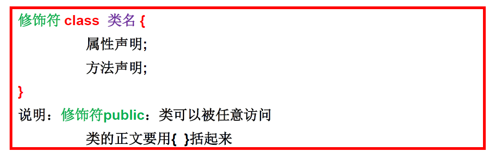
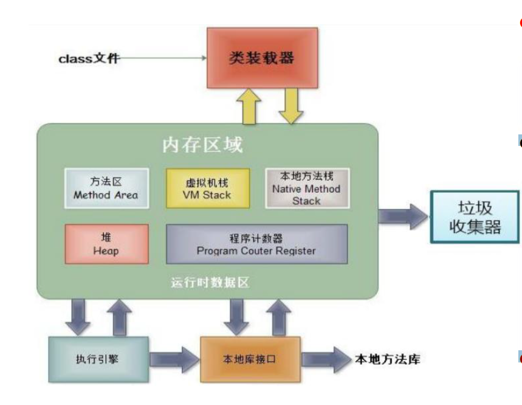
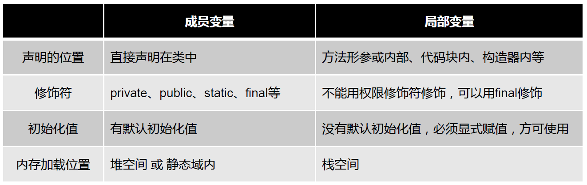
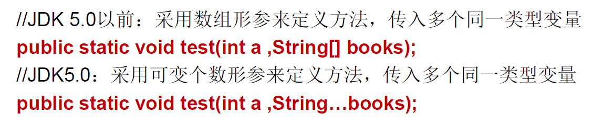
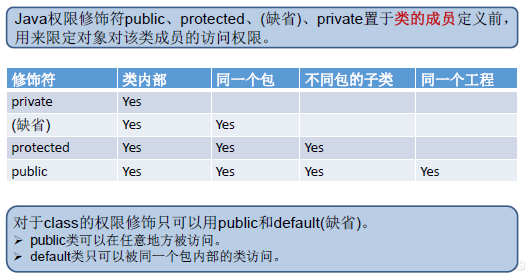
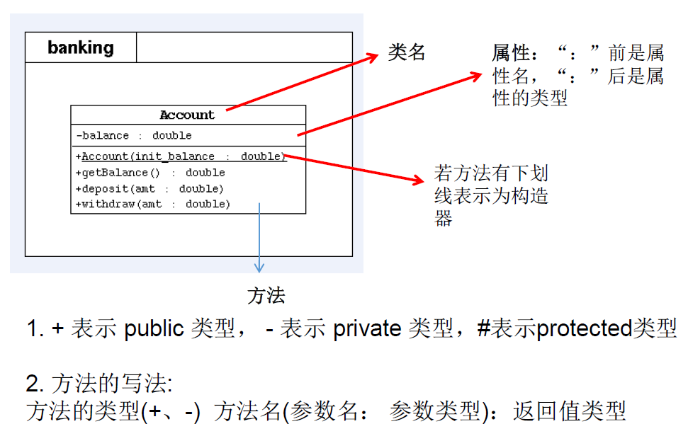

# 面向对象编程(上)
### 面向过程(POP)与面向对象(OOP)
 - 面向过程，强调的时功能行为，以函数为最小单位；
 - 面向对象，将功能封装进对象，强调具备了功能的对象，以类/对象为最小单位。
 - 面向对象的三大特征
   - 封装
   - 继承
   - 多态
### 类和对象
 - 类和对象时面向对象的核心概念
    - 类是对一类事物的描述，是抽象的，常见的类的成员有：属性（对应类中的成员变量），行为（对应类中的成员方法）
    - 对象是实际存在的该类事物的每个个体，因而也称为实例 
 - 类的语法格式
 
### 对象的创建和使用
 - 创建对象语法：类名 对象名 = new 类名();
 - 使用 对象名.对象成员 访问对象成员包括属性和方法
 - 类的访问机制：
    - 在一个类中的访问机制：类中的方法可以直接访问类中的成员变量。
       （例外：static方法访问非static，编译不通过。）
    - 在不同类中的访问机制：先创建要访问类的对象，再用对象访问类中定义的成员。
 - 内存解析
    - 堆：存放对象实例，所有的对象实例以及数组都要再堆上分配。
    - 栈：虚拟机栈，存储局部变量等，局部变量表存放了编译器可知长度的各种基本数据类型、对象引用。方法执行完，自动释放。
    - 方法区：存储已知被虚拟机加载的类信息、常量、静态变量、即时编译器编译后的代码等数据。
     
 - 匿名对象
    - 匿名对象：我们可以不定义对象的句柄，而直接调用这个对象的方法。如：new Person().shout();
    - 如果对一个对象只需要进行一次方法调用，那么就可以使用匿名对象。
    - 我们经常将匿名对象作为实参传递给一个方法调用。
### 类的成员之一————属性(field)
 - 语法格式：修饰符 数据类型 属性名 = 初始化值;
    - 常用的权限修饰符：private、缺省、protected、public
    - 其他修饰符：static、final、
 - 变量的分类：成员变量与局部变量
    - 在方法体外，类体内声明的变量称为成员变量。包括实例变量（不以static修饰），类变量（以static修饰）。
    - 在方法体内部声明的变量成为局部变量。包括形参（方法、构造器中定义的变量），方法局部变量（再方法内定义），代码块局部变量（在代码块中定义）。
    - 二者均有生命周期；局部变量除形参外，均需显示初始化。
      
### 类的成员之二————方法(method)
 - 什么是方法？
    - 方法是类或对象行为特征的抽象，用来完成某个功能操作。Java里的方法不能独立存在，所有的方法必须定义在类里。
 - 声明格式：
 
 
```
 修饰符 返回值类型 方法名(参数类型 形参1，参数类型 形参2，……){
     方法体程序
     return 返回值;
 }
```


    - 修饰符：public，缺省，private，protected等
    - 返回值类型：
       - 没有返回值：void
       - 有返回值：声明返回值的类型
 - 没有具体返回值的情况，返回值类型用关键字void表示，那么方法体中可以不必使用return语句。
 - 方法中只能调用方法或属性，不可以在方法内部定义方法。
 - 方法的重载
    - 概念：在同一个类中，允许存在一个以上的同名方法，只要它们的参数个数或参数类型不同即可。
    - 特点：与返回值类型无关，只看参数列表，且参数列表必须不同。调用时，根据方法参数列表的不同来区别。
 - 可变个数的形参
    - JavaSE 5.0中提供Varargs机制，允许直接定义能和多个实参相匹配的形参。
   
 
    - 可变参数的个数：0个，1个或多个
    - 方法的参数部分有可变形参，需要放在形参声明的最后
    - 在一个方法的形参位置，最多只能声明一个可变个数形参
 - 变量的赋值
    - 如果变量是基本数据类型（ byte（字节型）、short（短整型）、int（整型）、long（长整型）、float（单精度浮点型）、double（双精度浮点型）、boolean（布尔型）、char（字符型）），此时赋值的是变量所保存的数据值。
    - 如果变量是引用数据类型，此时复制的是变量所保存的数据的地址值。
 - 方法形参的传递机制：值传递
    - 形参是基本数据类型：将实参基本数据类型变量的“数据值”传递给形参
    - 形参是引用数据类型：将实参引用数据类型变量的“地址值”传递给形参
 - 递归方法：一个方法体内调用它自身
    - 方法递归包含了一种隐式的循环，他会重复执行某段代码，但这种重复执行无需循环控制。
    - 递归一定要向已知方向递归，否则这种递归就i变成了无穷递归，类似于死循环。
 
### 面向对象特征之一：封装和隐藏
Java中通过将数据声明为私有的(private)，再提供公共的(public)方法: getXxx 和 setXxx 实现对该属性的操作,以实现下述目的：  
 - 隐藏一个类中不需要对外提供的实现细节；
 - 使用者只能通过事先定制好的方法来访问数据,可以方便地加入控制逻辑,限制对属性的不合理操作；
 - 便于修改,增强代码的可维护性；  
 


### 类的成员之三————构造器
 - 构造器的特征
    - 它具有与类相同的名称
    - 它不声明返回值类型。（与声明为void不同）
    - 不能被static、final、synchronized、abstract、native修饰，不能有return语句返回值
 - 构造器的作用：创建对象；给对象进行初始化，如Person p = new Person("Peter",15)
 - 构造器的分类：
    - 隐式无参构造器（系统默认提供）
    - 显式的定义一个或多个构造器（无参、有参）
 - 注意点
    - 一旦显式的定义了构造器，则系统不在提供默认构造器
### 属性赋值过程
 - 赋值的位置
    - 默认初始化
    - 显式初始化
    - 构造器中初始化
    - 通过“对象.属性”或“对象.方法”的方式赋值
  - 赋值的先后顺序：从上到下（后面覆盖前面的）

### 关键字————this
 - this修饰属性和方法
    - 我们可以使用this来区分属性和局部变量，如this.name = name;可以理解为当前对象的name属性 = 形参name。  
    - 当形参与成员变量同名时，如果在方法内或构造器内需要使用成员变量，必须添加this来表明该变量是类的成员变量。
 - this调用构造器
    - 我们在类的构造器中，可以显式的使用“this(形参列表)”方式，调用本类中指定的其他构造器。
    - this调用构造器必须放在首行，最多只能有一个。

### 关键字————package
 - 使用package声明类或接口所属的包，声明在文件的首行
 - 每“.”一次就代表一层文件目录。

### 关键字——import
 - 为使用定义在不同包中的Java类，需用import语句来引入指定包层次下所需要的类或全部类。

### UML类图


### JavaBean
 - JavaBean是一种Java语言写成的可重用组件。
 - 所谓JavaBean，是指符合如下标准的Java类：
    - 类是公共的
    - 有一个无参的公共的构造器
    - 有属性，且有对应的get、set方法
 - 用户可以使用JavaBean将功能、处理、值、数据库访问和其他任何可以用Java代码创造的对象进行打包，并且其他的开发者可以通过内部的 JSP页面、 Servlet 其他JavaBean、applet程序或者应用来使用这些对象。用户可以认为JavaBean提供了一种随时随地的复制和粘贴的功能，而不用关心任何改变。
 
 ### 练习
  - 创建一个Person类
 ```
 package oop;

public class Person {
	String name;
	int age;
	/**
	 * sex:1表示男性
	 * sex:2表示女性
	 */
	int sex;
	
	public void study() {
		System.out.println("studying");
	}
	public void showAge() {
		System.out.println("age:" + age);	
	}
	public int addAge(int i) {
		age += i;
		return age;
	}
}

 package oop;

public class PersonTest {
	public static void main(String[] args) {
		Person p1 = new Person();
		
		p1.name = "Tom";
		p1.age = 18;
		p1.sex = 1;
		
		p1.study();
		p1.showAge();
		int newAge = p1.addAge(2);
		System.out.print(p1.name + "的新年龄为" + newAge + "岁");
	}
}
```
 - 利用面向对象的编程方法，设计类 Circle 计算圆的面积。
 ```
 package oop;

public class Circle {
	double radius;
	
	public double findArea() {
		double area = Math.PI * radius * radius;
		return area;
	}

}
package oop;

public class CircleTest {
	public static void main(String[] args) {
		
		Circle c1 = new Circle();		
		c1.radius = 5;		
		double area = c1.findArea();
		System.out.println(area);
	}

}
```

 - 将对象作为参数传递给方法
```
public class PassObject {
	public static void main(String[] args) {
		PassObject test = new PassObject();
		Circle c = new Circle();
		test.printAreas(c, 5);
		System.out.println("now radius is" + c.radius)
	}
	public void printAreas(Circle c, int time) {
		System.out.println("Radius\t\tArea");
		//设置圆的半径
		for(int i = 1;i <= time;i++) {
			c.radius = i;
			System.out.println(c.radius + "\t\t" + c.findArea());
		}
		c.radius = time + 1
	}
}
```
 - 递归方法
```
public class recursion {
	public int f(int n) {
		if(n == 0) {
			return 1;
		}else if(n == 1) {
			return 4;
		}else {
			return 2*f(n-1) + f(n - 2);
		}
	}
}
```
 - 封装性
 ```
public class NewPerson {
	private int age;
	public void setAge(int a ) {
		if(a<0 || a > 130) {
			System.out.println("传入的数据非法");
			return;
		}
		age = a;				
	}
	public int getAge() {
		return age;
	}
}
public class NewPersonTest {
	public static void main(String[] args) {
		NewPerson p1 = new NewPerson();
		p1.setAge(12);
		System.out.println("年龄为" + p1.getAge());
	}

}
```

